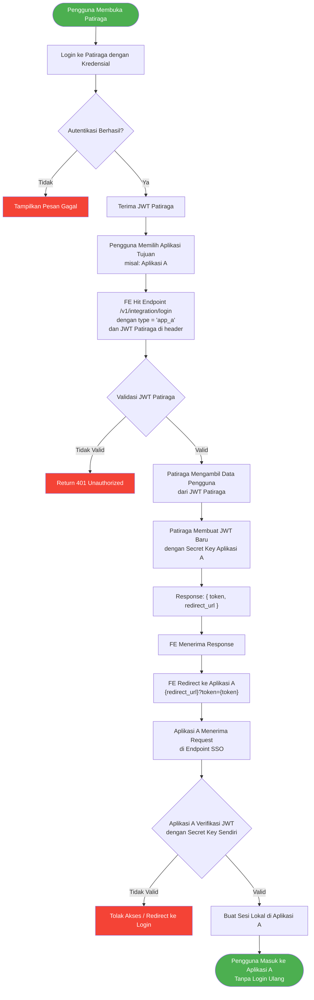
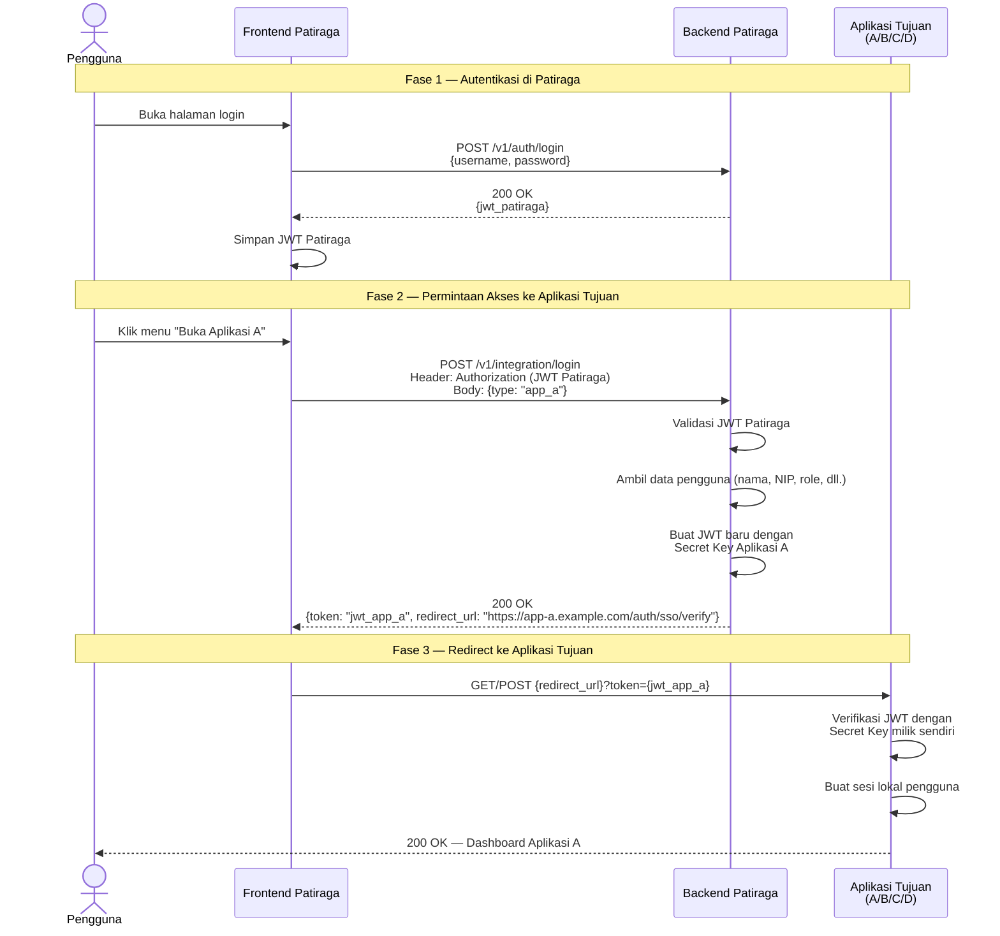
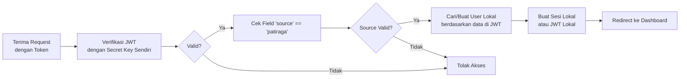

# Dokumentasi Integrasi Aplikasi Eksternal

## Daftar Isi

- [Pendahuluan](#pendahuluan)
- [Arsitektur Umum](#arsitektur-umum)
- [Diagram Alur (Flow Chart)](#diagram-alur-flow-chart)
- [Sequence Diagram](#sequence-diagram)
- [Langkah-Langkah Integrasi](#langkah-langkah-integrasi)
  - [Langkah 1 — Pengguna Masuk ke Patiraga](#langkah-1--pengguna-masuk-ke-patiraga)
  - [Langkah 2 — Permintaan Token Aplikasi Tujuan](#langkah-2--permintaan-token-aplikasi-tujuan)
  - [Langkah 3 — Patiraga Membuat JWT dengan Secret Key Aplikasi Tujuan](#langkah-3--patiraga-membuat-jwt-dengan-secret-key-aplikasi-tujuan)
  - [Langkah 4 — Frontend Menerima Token dan Mengalihkan ke Aplikasi Tujuan](#langkah-4--frontend-menerima-token-dan-mengalihkan-ke-aplikasi-tujuan)
  - [Langkah 5 — Aplikasi Tujuan Memverifikasi Token](#langkah-5--aplikasi-tujuan-memverifikasi-token)
- [Kontrak API](#kontrak-api)
  - [Endpoint Login Integrasi](#endpoint-login-integrasi)
  - [Endpoint Penerima di Aplikasi Tujuan](#endpoint-penerima-di-aplikasi-tujuan)
- [Konfigurasi](#konfigurasi)
- [Keamanan](#keamanan)
- [Persiapan oleh Tim Patiraga](#persiapan-oleh-tim-patiraga)
- [Persiapan oleh Tim Aplikasi Tujuan (A / B / C / D)](#persiapan-oleh-tim-aplikasi-tujuan-a--b--c--d)

---

## Pendahuluan

Dokumen ini menjelaskan mekanisme integrasi **Single Sign-On (SSO)** dari aplikasi **Patiraga** ke aplikasi eksternal (selanjutnya disebut **Aplikasi A**, **Aplikasi B**, **Aplikasi C**, dan **Aplikasi D**).

Tujuan integrasi ini adalah agar pengguna yang sudah terautentikasi di Patiraga dapat mengakses aplikasi-aplikasi lain tanpa perlu melakukan proses login ulang. Patiraga bertindak sebagai **pusat autentikasi (Identity Provider)** yang menerbitkan token JWT yang dapat dikenali oleh masing-masing aplikasi tujuan.

---

## Arsitektur Umum

```
┌──────────────────────────────────────────────────────────────────┐
│                          PENGGUNA                                │
│                        (Browser/FE)                              │
└──────────┬───────────────────────────────────────┬───────────────┘
           │ 1. Login dengan                       │ 4. Redirect dengan
           │    kredensial Patiraga                   │    JWT aplikasi tujuan
           ▼                                       ▼
┌─────────────────────┐                ┌─────────────────────────┐
│                     │                │   Aplikasi Tujuan       │
│      ASTANA         │                │   (A / B / C / D)       │
│   (API Gateway)     │                │                         │
│                     │                │  ┌───────────────────┐  │
│  ┌───────────────┐  │                │  │ Endpoint Penerima │  │
│  │ JWT Patiraga    │  │                │  │ /auth/sso/verify  │  │
│  │ Secret Key    │  │                │  └───────────────────┘  │
│  └───────────────┘  │                │                         │
│                     │  3. Buat JWT   │  ┌───────────────────┐  │
│  ┌───────────────┐  │──────────────▶ │  │ JWT Verification  │  │
│  │ Secret Key    │  │   dengan       │  │ (secret key own)  │  │
│  │ App A,B,C,D   │  │   secret key   │  └───────────────────┘  │
│  └───────────────┘  │   app tujuan   │                         │
└─────────────────────┘                └─────────────────────────┘
```

**Prinsip Utama:**

| No | Komponen | Keterangan |
|----|----------|------------|
| 1 | **JWT Patiraga** | Digunakan untuk autentikasi internal di Patiraga. Dibuat menggunakan `JWT_SECRET_KEY` milik Patiraga. |
| 2 | **JWT Aplikasi Tujuan** | Diterbitkan oleh Patiraga menggunakan secret key milik aplikasi tujuan. Token ini hanya bisa diverifikasi oleh aplikasi tujuan yang bersangkutan. |
| 3 | **Secret Key Aplikasi Tujuan** | Disimpan di konfigurasi Patiraga (environment variable atau vault). Patiraga **tidak pernah** membagikan secret key ini ke pihak lain. |

---

## Diagram Alur (Flow Chart)



---

## Sequence Diagram



---

## Langkah-Langkah Integrasi

### Langkah 1 — Pengguna Masuk ke Patiraga

Pengguna melakukan login ke aplikasi Patiraga melalui endpoint login standar. Setelah berhasil, pengguna mendapatkan **JWT Patiraga** yang ditandatangani menggunakan `JWT_SECRET_KEY` milik Patiraga.

| Item | Detail |
|------|--------|
| **Endpoint** | `POST /v1/auth/login` |
| **Request Body** | `{ "username": "...", "password": "..." }` |
| **Response** | `{ "token": "<jwt_patiraga>" }` |
| **Secret Key** | `JWT_SECRET_KEY` (milik Patiraga) |

JWT ini digunakan untuk seluruh operasi internal di Patiraga dan sebagai **bukti identitas** untuk proses integrasi berikutnya.

---

### Langkah 2 — Permintaan Token Aplikasi Tujuan

Ketika pengguna ingin mengakses aplikasi lain (A/B/C/D), frontend mengirim permintaan ke **satu endpoint tunggal** yang membedakan aplikasi tujuan berdasarkan field `type`.

| Item | Detail |
|------|--------|
| **Endpoint** | `POST /v1/integration/login` |
| **Header** | `Authorization: Bearer <hmac>_<jwt_patiraga>` |
| **Request Body** | `{ "type": "app_a" }` |

**Nilai `type` yang tersedia:**

| Nilai `type` | Aplikasi Tujuan |
|--------------|-----------------|
| `app_a` | Aplikasi A |
| `app_b` | Aplikasi B |
| `app_c` | Aplikasi C |
| `app_d` | Aplikasi D |

Backend Patiraga akan:
1. Memvalidasi JWT Patiraga dari header `Authorization`.
2. Menentukan aplikasi tujuan berdasarkan nilai `type`.
3. Melanjutkan ke Langkah 3 jika validasi berhasil.

---

### Langkah 3 — Patiraga Membuat JWT dengan Secret Key Aplikasi Tujuan

Setelah validasi berhasil, Patiraga mengambil data pengguna dari JWT Patiraga dan membuat **JWT baru** yang ditandatangani menggunakan **secret key milik aplikasi tujuan**.

**Payload JWT yang diterbitkan:**

```json
{
  "sub": "user-uuid-12345",
  "name": "Budi Santoso",
  "nip": "198501012010011001",
  "role": "admin",
  "source": "patiraga",
  "iat": 1712567890,
  "exp": 1712568190
}
```

| Field | Keterangan |
|-------|------------|
| `sub` | ID unik pengguna |
| `name` | Nama lengkap pengguna |
| `nip` | Nomor Induk Pegawai (jika berlaku) |
| `role` | Peran pengguna di Patiraga |
| `source` | Penanda bahwa token berasal dari Patiraga |
| `iat` | Waktu token diterbitkan (epoch) |
| `exp` | Waktu kedaluwarsa token — **disarankan 5 menit** untuk keamanan |

> **Penting:** Masa berlaku token (exp) sebaiknya singkat (3–5 menit) karena token ini hanya digunakan sekali untuk proses redirect.

**Response:**

```json
{
  "token": "<jwt_yang_ditandatangani_dengan_secret_key_app_tujuan>",
  "redirect_url": "https://app-a.example.com/auth/sso/verify"
}
```

---

### Langkah 4 — Frontend Menerima Token dan Mengalihkan ke Aplikasi Tujuan

Frontend menerima response dari Langkah 3 dan melakukan **redirect** ke aplikasi tujuan dengan menyertakan token sebagai parameter.

**Cara redirect (pilih salah satu sesuai kebutuhan):**

**Opsi A — Query Parameter (GET)**

```
https://app-a.example.com/auth/sso/verify?token=<jwt_app_a>
```

**Opsi B — Form POST (lebih aman, token tidak terekspos di URL/log)**

```html
<form method="POST" action="https://app-a.example.com/auth/sso/verify">
  <input type="hidden" name="token" value="<jwt_app_a>" />
</form>
<script>document.forms[0].submit();</script>
```

> **Rekomendasi:** Gunakan **Opsi B (Form POST)** untuk keamanan yang lebih baik karena token tidak akan muncul di log server, riwayat browser, atau header `Referer`.

---

### Langkah 5 — Aplikasi Tujuan Memverifikasi Token

Aplikasi tujuan (A/B/C/D) **wajib menyediakan endpoint** untuk menerima dan memverifikasi token dari Patiraga.

**Proses di aplikasi tujuan:**



**Yang harus dilakukan aplikasi tujuan:**

1. **Buat endpoint** `POST /auth/sso/verify` (atau sesuai kesepakatan).
2. **Verifikasi JWT** menggunakan secret key milik sendiri (algoritma HS256).
3. **Validasi field `source`** — pastikan bernilai `"patiraga"`.
4. **Validasi `exp`** — tolak token yang sudah kedaluwarsa.
5. **Cari atau buat pengguna** di basis data lokal berdasarkan data di JWT (NIP, nama, dsb.).
6. **Buat sesi lokal** atau JWT lokal milik aplikasi tujuan.
7. **Redirect pengguna** ke halaman utama/dashboard.

---

## Kontrak API

### Endpoint Login Integrasi

**Disediakan oleh Patiraga.**

```
POST /v1/integration/login
```

**Header:**

| Header | Nilai | Keterangan |
|--------|-------|------------|
| `Authorization` | `Bearer <hmac>_<jwt_patiraga>` | Autentikasi standar Patiraga |
| `Date` | `<epoch_ms>` | Waktu permintaan (epoch milidetik) |
| `Content-Type` | `application/json` | — |

**Request Body:**

```json
{
  "type": "app_a"
}
```

**Response Sukses (200):**

```json
{
  "code": 200,
  "message": "success",
  "data": {
    "token": "eyJhbGciOiJIUzI1NiIs...",
    "redirect_url": "https://app-a.example.com/auth/sso/verify"
  }
}
```

**Response Gagal (401):**

```json
{
  "code": 401,
  "message": "unauthorized",
  "data": null
}
```

**Response Gagal (400) — Tipe tidak dikenali:**

```json
{
  "code": 400,
  "message": "tipe aplikasi tidak valid",
  "data": null
}
```

---

### Endpoint Penerima di Aplikasi Tujuan

**Wajib disediakan oleh setiap aplikasi tujuan (A/B/C/D).**

```
POST /auth/sso/verify
```

**Request Body:**

```json
{
  "token": "eyJhbGciOiJIUzI1NiIs..."
}
```

**Atau via Query Parameter (jika menggunakan GET):**

```
GET /auth/sso/verify?token=eyJhbGciOiJIUzI1NiIs...
```

**Response Sukses:**

Redirect (HTTP 302) ke halaman dashboard aplikasi tujuan, dengan sesi/cookie yang sudah terbentuk.

**Response Gagal:**

Redirect ke halaman login aplikasi tujuan atau tampilkan pesan kesalahan.

---

## Konfigurasi

Tambahkan variabel lingkungan berikut di **Patiraga** untuk menyimpan secret key dan URL masing-masing aplikasi tujuan:

```env
# Integrasi Aplikasi A
INTEGRATION_APP_A_JWT_SECRET=<secret_key_aplikasi_a>
INTEGRATION_APP_A_REDIRECT_URL=https://app-a.example.com/auth/sso/verify

# Integrasi Aplikasi B
INTEGRATION_APP_B_JWT_SECRET=<secret_key_aplikasi_b>
INTEGRATION_APP_B_REDIRECT_URL=https://app-b.example.com/auth/sso/verify

# Integrasi Aplikasi C
INTEGRATION_APP_C_JWT_SECRET=<secret_key_aplikasi_c>
INTEGRATION_APP_C_REDIRECT_URL=https://app-c.example.com/auth/sso/verify

# Integrasi Aplikasi D
INTEGRATION_APP_D_JWT_SECRET=<secret_key_aplikasi_d>
INTEGRATION_APP_D_REDIRECT_URL=https://app-d.example.com/auth/sso/verify
```

> **Catatan:** Secret key ini **diberikan oleh tim pengembang masing-masing aplikasi tujuan** dan harus disimpan secara aman (melalui Vault atau environment variable yang terenkripsi).

---

## Keamanan

| Aspek | Kebijakan |
|-------|-----------|
| **Masa berlaku token** | Token integrasi berlaku maksimal **5 menit** dan hanya untuk sekali pakai. |
| **Penyimpanan secret key** | Disimpan di environment variable atau Vault, **tidak pernah** di-hardcode dalam kode sumber. |
| **Metode redirect** | Disarankan menggunakan **Form POST** agar token tidak terekspos di URL. |
| **Validasi field `source`** | Aplikasi tujuan wajib memeriksa bahwa field `source` bernilai `"patiraga"`. |
| **HTTPS** | Seluruh komunikasi **wajib** menggunakan HTTPS. |
| **Audit log** | Setiap permintaan integrasi dicatat di log Patiraga untuk keperluan audit. |
| **Pembatasan akses** | Hanya pengguna yang sudah login di Patiraga yang dapat meminta token integrasi. |

---

## Persiapan oleh Tim Patiraga

Berikut hal-hal yang perlu disiapkan oleh tim pengembang **Patiraga** sebelum integrasi dapat dijalankan:

### Checklist Patiraga

- [ ] **Terima secret key JWT** dari masing-masing tim aplikasi tujuan (A, B, C, D).
- [ ] **Terima redirect URL** endpoint SSO dari masing-masing aplikasi tujuan.
- [ ] **Simpan secret key dan redirect URL** ke dalam environment variable atau Vault (lihat bagian [Konfigurasi](#konfigurasi)).
- [ ] **Buat endpoint** `POST /v1/integration/login` yang menerima parameter `type` untuk menentukan aplikasi tujuan.
- [ ] **Implementasi logika pembuatan JWT** — mengambil data pengguna dari JWT Patiraga, lalu menerbitkan JWT baru menggunakan secret key aplikasi tujuan.
- [ ] **Tentukan payload JWT** yang akan dikirim — koordinasikan dengan tim aplikasi tujuan mengenai field apa saja yang mereka butuhkan (misalnya `sub`, `name`, `nip`, `role`, `source`).
- [ ] **Atur masa berlaku token** integrasi (disarankan 3–5 menit).
- [ ] **Tambahkan validasi `type`** — pastikan hanya nilai yang terdaftar (`app_a`, `app_b`, `app_c`, `app_d`) yang diterima.
- [ ] **Catat audit log** untuk setiap permintaan integrasi (siapa, kapan, ke aplikasi mana).
- [ ] **Siapkan dokumentasi internal** untuk tim frontend mengenai cara menggunakan endpoint integrasi dan melakukan redirect.
- [ ] **Uji coba end-to-end** dengan masing-masing aplikasi tujuan sebelum go-live.

### Informasi yang Perlu Diberikan ke Aplikasi Tujuan

| Informasi | Keterangan |
|-----------|------------|
| **Struktur payload JWT** | Daftar field dan tipe data yang akan ada di dalam token (lihat bagian [Langkah 3](#langkah-3--patiraga-membuat-jwt-dengan-secret-key-aplikasi-tujuan)). |
| **Algoritma penandatanganan** | **HS256** (HMAC-SHA256). |
| **Nilai field `source`** | `"patiraga"` — aplikasi tujuan wajib memvalidasi field ini. |
| **Masa berlaku token** | 3–5 menit sejak diterbitkan. |
| **Metode pengiriman token** | Query parameter (GET) atau form body (POST) — sesuai kesepakatan. |
| **IP/domain Patiraga** | Agar aplikasi tujuan dapat membatasi akses (whitelist) jika diperlukan. |

---

## Persiapan oleh Tim Aplikasi Tujuan (A / B / C / D)

Berikut hal-hal yang perlu disiapkan oleh tim pengembang masing-masing aplikasi tujuan:

### Checklist Aplikasi Tujuan

- [ ] **Berikan secret key JWT** kepada tim Patiraga (secret key yang sama yang digunakan untuk memverifikasi JWT di aplikasi Anda).
- [ ] **Buat endpoint** `POST /auth/sso/verify` (atau endpoint lain sesuai kesepakatan).
- [ ] **Verifikasi JWT** yang diterima menggunakan secret key milik Anda (algoritma **HS256**).
- [ ] **Validasi field `source`** pada payload JWT — pastikan bernilai `"patiraga"`.
- [ ] **Validasi `exp`** — tolak token yang sudah kedaluwarsa.
- [ ] **Cari atau buat pengguna lokal** berdasarkan data dalam JWT (misalnya NIP, nama, role).
- [ ] **Buat sesi lokal** dan redirect pengguna ke dashboard.
- [ ] **Informasikan redirect URL** endpoint Anda kepada tim Patiraga untuk dikonfigurasi.
- [ ] **Pastikan HTTPS** aktif pada endpoint SSO.
- [ ] **(Opsional) Whitelist IP/domain Patiraga** untuk membatasi sumber permintaan yang diterima.

### Informasi yang Perlu Diberikan ke Patiraga

| Informasi | Keterangan |
|-----------|------------|
| **Secret key JWT** | Secret key yang digunakan aplikasi Anda untuk memverifikasi JWT. Patiraga akan menggunakan key ini untuk menandatangani token. |
| **Redirect URL** | URL lengkap endpoint SSO penerima, misalnya `https://app-a.example.com/auth/sso/verify`. |
| **Metode penerimaan token** | Apakah endpoint menerima token via **query parameter (GET)**, **form body (POST)**, atau keduanya. |
| **Field tambahan yang dibutuhkan** | Jika aplikasi Anda membutuhkan field khusus di payload JWT selain yang standar (misalnya `unit_kerja`, `jabatan`), informasikan kepada tim Patiraga. |

### Contoh Kode Verifikasi (Pseudocode)

```go
func SSOVerifyHandler(w http.ResponseWriter, r *http.Request) {
    tokenString := r.FormValue("token")
    if tokenString == "" {
        tokenString = r.URL.Query().Get("token")
    }

    claims := &Claims{}
    token, err := jwt.ParseWithClaims(tokenString, claims, func(t *jwt.Token) (interface{}, error) {
        return []byte(os.Getenv("JWT_SECRET_KEY")), nil
    })

    if err != nil || !token.Valid {
        http.Redirect(w, r, "/login?error=invalid_token", http.StatusFound)
        return
    }

    if claims.Source != "patiraga" {
        http.Redirect(w, r, "/login?error=invalid_source", http.StatusFound)
        return
    }

    user := findOrCreateUser(claims.NIP, claims.Name, claims.Role)
    session := createSession(user)
    setSessionCookie(w, session)

    http.Redirect(w, r, "/dashboard", http.StatusFound)
}
```

---

*Dokumen ini dibuat pada April 2026. Untuk pertanyaan atau klarifikasi, silakan hubungi tim pengembang Patiraga.*
